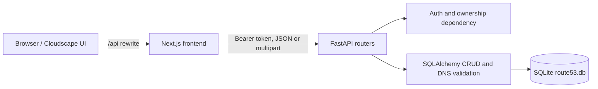

# Route 53 Console Clone

A Route 53 style console for hosted zones and DNS records. It uses a Next.js App Router frontend, Cloudscape Design System components, a FastAPI REST API, SQLAlchemy, and SQLite.

## Features

- Email/password signup and login, bearer-token sessions, logout, and seven-day session expiry.
- Per-user hosted-zone and record isolation.
- Hosted-zone and DNS record create, read, update, delete, search, filtering, sorting, selection, and pagination.
- DNS record support for A, AAAA, CNAME, TXT, MX, NS, PTR, SRV, CAA, and SOA, with type-specific and routing-policy validation.
- Hosted-zone record counts, generated zone IDs, and apex NS/SOA protection.
- JSON and BIND export, plus BIND import with skip reasons.
- Cloudscape notifications, responsive navigation, dark mode, bulk record deletion, and keyboard shortcuts.
- Coming Soon views for Dashboard, Traffic Policies, Health Checks, Resolver, Profiles, DNSSEC signing, Query logging, and Tags.

## Tech stack

| Area | Technology |
| --- | --- |
| Frontend | Next.js 16, TypeScript, React 19, Cloudscape Design System |
| Backend | FastAPI, Pydantic, SQLAlchemy |
| Database | SQLite |
| Frontend package manager | pnpm |

## Run locally

### Requirements

- Node.js 20 or newer
- Python 3.10 or newer
- pnpm

### Backend

```bash
cd backend
python -m venv .venv
source .venv/bin/activate
pip install -r requirements.txt
cp .env.example .env
set -a
source .env
set +a
uvicorn main:app --reload
```

The API listens on `http://localhost:8000`; interactive API documentation is at `http://localhost:8000/docs`.

### Frontend

In another terminal:

```bash
cd frontend
pnpm install
cp .env.example .env.local
pnpm run dev
```

Open `http://localhost:3000`. The Next.js rewrite proxies `/api/*` to `API_URL`, which defaults to `http://localhost:8000`.

The backend reads `DATABASE_URL` (default `sqlite:///./route53.db`) and `FRONTEND_URL` (default `http://localhost:3000`). Environment example files are templates; configure variables in the shell or deployment environment because the backend does not load `.env` files itself.

### Demo data

```bash
cd backend
python seed.py
```

This creates a demo user and several sample zones and records. Sign in with **demo@example.com** and **Demo@12345**.

## Architecture



The frontend stores the mock session token in localStorage and mirrors it in a `session` cookie for route protection. API calls send `Authorization: Bearer <token>`. Backend routes resolve the token to an email and scope zone and record operations to that owner. The frontend uses Cloudscape tables and collection hooks for client-side filtering, sorting, selection, and pagination.

## Database schema

`Base.metadata.create_all()` creates the schema when the backend starts. There are no startup data migrations. The local database is disposable: when moving to a schema that is incompatible with an existing SQLite file, stop the backend, remove `backend/route53.db`, and start it again to create a fresh database. This resets local users and zones.

| Table | Column | Type | Constraints / notes |
| --- | --- | --- | --- |
| `users` | `id` | integer | Primary key |
|  | `email` | string | Unique and indexed |
|  | `password` | string | bcrypt password hash |
| `sessions` | `id` | integer | Primary key |
|  | `token` | string | Unique and indexed bearer token |
|  | `user_email` | string | Indexed owner email |
|  | `created_at` | datetime | UTC creation time; valid for seven days |
| `hosted_zones` | `id` | integer | Primary key |
|  | `name` | string | Indexed zone name |
|  | `comment` | string | Nullable description |
|  | `user_id` | string | Indexed owner email |
|  | `zone_type` | string | `public` or `private` |
|  | `created_at` | datetime | UTC creation time |
|  | `record_count` | integer | Response value is computed with a COUNT query |
|  | `created_by` | string | Owner email |
|  | `zone_id_str` | string | Generated once; `Z` plus 13 uppercase alphanumeric characters |
|  | constraint | — | Unique `(user_id, name)` |
| `records` | `id` | integer | Primary key |
|  | `zone_id` | integer | Foreign key to `hosted_zones.id`, cascade delete |
|  | `name` | string | Fully qualified name within the zone |
|  | `type` | string | DNS type |
|  | `value` | string | DNS value or RDATA |
|  | `ttl` | integer | Defaults to 300 seconds |
|  | `routing_policy` | string | Simple, Weighted, Latency, Geolocation, or Failover |
|  | `weight` | integer | Nullable; 0–255 for Weighted |
|  | `region` | string | Nullable; required for Latency and Geolocation |
|  | `failover_type` | string | Nullable; PRIMARY or SECONDARY for Failover |
|  | `set_identifier` | string | Nullable in storage; missing values normalize to the empty string |
|  | indexes | — | Index on `zone_id`; unique `(zone_id, name, type, set_identifier)` |

Apex NS rows receive distinct identifiers matching their target nameserver so all four nameservers can coexist under the record uniqueness constraint. Apex NS and SOA records cannot be edited or deleted through the API.

## API overview

All protected routes require `Authorization: Bearer <token>`. List routes always return a JSON array and set `X-Total-Count` to the total matching rows before pagination. CORS exposes this header to the frontend.

| Method | Path | Request / query | Response |
| --- | --- | --- | --- |
| POST | `/auth/signup` | `{email, password}` | `{email, token}` |
| POST | `/auth/login` | `{email, password}` | `{email, token}` |
| POST | `/auth/logout` | Bearer token | `{ok: true}` |
| GET | `/auth/me` | Bearer token | `{email}`; removes and rejects expired sessions |
| GET | `/hosted-zones` | Optional `q`, `limit`, `offset` | Hosted-zone array + `X-Total-Count` |
| POST | `/hosted-zones` | `{name, comment?, zone_type?}` | Created hosted zone |
| GET | `/hosted-zones/{id}` | — | Owned hosted zone |
| PUT | `/hosted-zones/{id}` | `{comment?}` | Updated hosted zone; name is immutable |
| DELETE | `/hosted-zones/{id}` | — | `{ok: true}`; 404 if absent or not owned |
| GET | `/hosted-zones/{id}/records` | Optional `q`, `type`, `routing_policy`, `limit`, `offset` | Record array + `X-Total-Count` |
| POST | `/hosted-zones/{id}/records` | Record create fields | Created record; 409 for duplicate key |
| PUT | `/records/{id}` | Partial record fields | Updated owned record |
| DELETE | `/records/{id}` | — | `{ok: true}`; 404 if absent or not owned |
| GET | `/hosted-zones/{id}/export?format=json\|bind` | `format` defaults to `json` | Zone and records JSON, or BIND text |
| POST | `/hosted-zones/{id}/import` | Multipart field `file` with BIND text | Imported/skipped counts and skip reasons |

Record names may be relative, `@` for the apex, or fully qualified within their zone. Type-specific value validation runs for creation and for the merged record on update. Non-Simple routing policies require a set identifier and their policy-specific fields.

## Deployment

The repository's existing `Dockerfile` and `run.sh` deployment setup are intentionally left unchanged. Configure `API_URL`, `FRONTEND_URL`, and `DATABASE_URL` in that environment. For persistent data, set `DATABASE_URL` to a SQLite file path on a mounted writable volume; an ephemeral filesystem loses users and hosted zones when the service restarts. A local SQLite database is suitable for this clone, not a horizontally scaled production database.

## Demo

Hosted demo: [Route 53 Clone](https://route53-production-6f57.up.railway.app/hosted-zones/2)

Screenshots:

- Hosted zones: `[Add screenshot]`
- Zone records: `[Add screenshot]`
- Create hosted zone: `[Add screenshot]`
